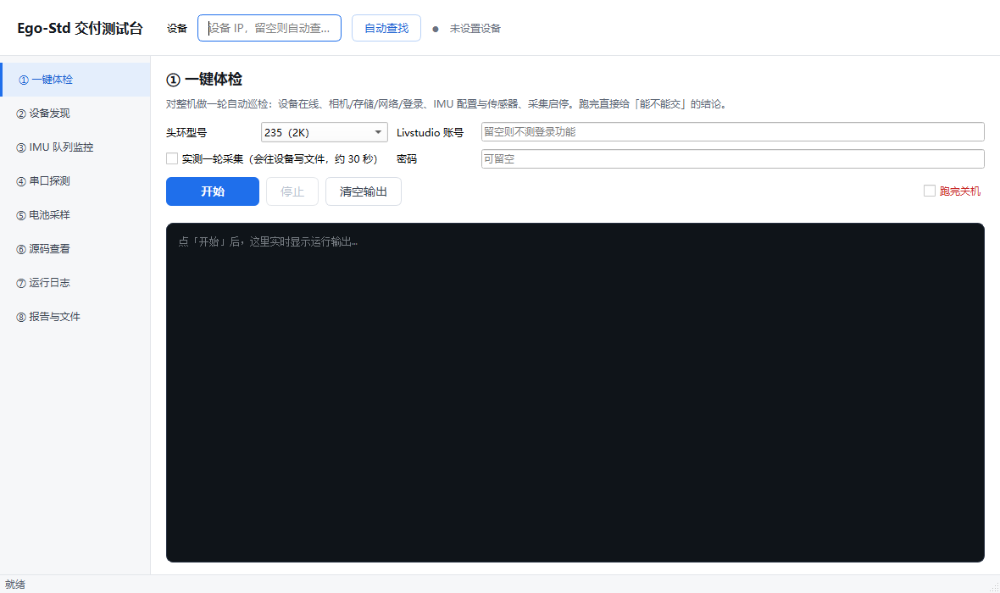

# Ego-Std 交付测试台

面向 ego-std 人形数采设备的**交付前自检工具包**。把原来需要逐项手工点检的流程，
变成「点一下 → 出结论」的自动化巡检，用于出厂检查、交付验收和现场排障。

- **GUI 版**：一个桌面窗口，左边选功能、右边看结果，不需要记命令
- **CLI 版**：同一批脚本也能在命令行 / CI 里单独调用
- 单台设备巡检耗时从人工 **3–5 分钟**压到 **约 50 秒**

---

## 快速开始

### 1. 首次安装（只做一次）

双击 **`安装依赖.bat`**。它会自动找到本机 Python 3.11+，建好独立虚拟环境并装齐依赖
（PySide6 / paramiko / openpyxl，约 150MB，走国内镜像）。

> 提示：本机需要先装 Python（https://www.python.org/downloads/ ），安装时勾选
> `Add Python to PATH`。

### 2. 启动

双击 **`启动测试台.bat`**。

如果窗口一闪就没、或想看到错误信息，改用 **`启动测试台-调试.bat`**（保留控制台窗口）。

---

## 界面功能

<!-- 更多界面截图见 docs/ 目录（ui_1.png ~ ui_8.png） -->


顶部会显示当前设备 IP 和在线状态（绿点=在线，红点=连不上）。**IP 不用手填**——
点「自动查找」会扫描本机所在网段，只有能拉通设备 API 的才算数，结果自动记住。

| 功能 | 做什么 | 典型场景 |
|---|---|---|
| ① 一键体检 | 一轮自动巡检：设备在线、相机、存储、网络、登录、IMU 配置与传感器、采集启停，末尾给「能不能交」结论 | 出厂检查、交付验收 |
| ② 批量巡检 | **一次给一整批设备并发跑同一套体检**，结束出一张总表（IP/版本/相机/通过失败告警/耗时）+ 导出 HTML/Excel/CSV | 17 台量产、整间实验室点检 |
| ③ 设备发现 | 扫描网段找设备，支持指定额外网段 | IP 变了、换了 WiFi |
| ④ IMU 队列监控 | 实时看录制队列水位与各数据流频率 | 采集掉线、丢帧排查 |
| ⑤ 串口探测 | 直读头环 IMU 串口，统计真实字节率与帧率 | 判断实际输出频率是否超配置 |
| ⑥ 电池采样 | 长时间采样电压/电流/电量，结束时判定充不满的根因 | 「充到 XX% 上不去」 |
| ⑦ 源码查看 | 无需 docker/sudo，直接读设备上运行的容器源码 | 版本差异比对、验收 |
| ⑧ 运行日志 | 探测设备日志位置并列出最近内容 | 现场排障 |
| ⑨ 报告与文件 | 打开报告目录，HTML/Excel/CSV 都在这里 | 交付归档 |

### 「跑完关机」

每个功能页右下角有个 `跑完关机` 勾选框：勾上后任务结束会自动排定 60 秒倒计时关机，
适合**晚上挂长任务**（比如 8 小时电池采样、隔夜批量巡检）。倒计时期间随时可用 `shutdown /a` 取消。

> ⚠️ 关机命令只作用于**运行本工具的电脑**，管不到设备本身。
> 关机前请确认设备侧数据已经写完（先停采集、等落盘），否则可能丢数据。

---

## 批量巡检

一批设备（17 台 / 整间实验室）用同一个标准逐台过一遍，并发执行，出一张总表。

### 图形界面：② 批量巡检

1. 打开就自动扫描本机网段，把所有设备列进清单（**全量**，不是只找一台）
2. 勾掉不想测的机器，调整并发数（WiFi 建议 3-5，交换机可以 8-10）
3. 点「开始」→ 进度条 + 实时逐台结果
4. 跑完看汇总 banner：合格几台、告警几台、不合格几台
5. 点「导出 Excel」拿到失败明细，按 IP 对号入座发给开发

勾上「**只导出不合格设备明细**」可以只列需要跟进的机器——交付场景常用。

### 命令行

```bash
# 自动扫描网段全部设备
python batch_check.py --discover

# 指定设备（逗号分隔）
python batch_check.py --ip 192.168.195.21,192.168.195.44

# 从文件读清单（每行一个 IP，# 开头是注释）
python batch_check.py --file ips.txt

# 常用组合
python batch_check.py --discover --workers 8 --timeout 120
python batch_check.py --discover --xlsx out/点检表.xlsx
python batch_check.py --discover --do-collect      # 额外实测采集启停（会写文件）
```

`run.bat` 里选 `6` 也是同一个脚本。

### 报告都有什么

| 格式 | 内容 | 用途 |
|---|---|---|
| HTML | 汇总卡片 + 总表 + 每台的失败项明细（可展开） | 发群里、存档 |
| Excel | `汇总` 页（带颜色标记）+ `失败明细` 页 | 继续筛选、二次加工 |
| CSV | 总表 + 失败明细（UTF-8 BOM，Excel 直接打开不乱码） | 导入别的系统 |

文件名都带时间戳（`batch_20261003_110509.html`），落在 `out/`。

### 判定规则

一台设备只要有 **FAIL** 项就算不合格（整批退出码 1）；只有 WARN 不算不合格。
`PASS` 项越多越好，但要看的是 **FAIL 那几项**——现场常见的是没接头环、没插外置 SSD、
IMU 关闭录制，这些 FAIL 属于环境没铺好而不是机器坏了。

### 几个实现上的关键点

- **每台跑在独立子进程里**，不是线程内直接调。原因是 `ego_api_test.py` 的 `--quiet`
  用 `contextlib.redirect_stdout` 抓日志，那是**进程级全局状态、非线程安全**，
  并发起来会互相串台。子进程同时解决「一台卡死拖垮整批」和「一台崩了整批全崩」。
- **单台超时直接 kill**（默认 180s），不让一台机器把整批挂住。
- **默认不做 DEV-ONLINE 门禁**：不同批次设备的逻辑 id 不一样（现场见过 `ego-std-235`，
  也有 `ego-lite-01`），写死一个会让每台都误判 FAIL。要测就在命令行加 `--device-id`。
- 设备清单用 `find_device.py --list` 取全量。`--quiet` 是历史行为（**只给第一台**），
  `run.bat` 依赖它，别拿来喂批量。

---

## 命令行用法

脚本可以脱离 GUI 单独跑，`--host` 可省略（省略时读 `device_ip.txt`，
没有就自动扫描网段）。

```bash
# 整机体检（--do-collect 会真跑一轮采集并写文件）
python ego_api_test.py --do-collect
python ego_api_test.py --model 235 --account <账号> --password <密码>

# 机器可读输出（批量调度用，人工跑不用加）
python ego_api_test.py --host <IP> --json-only --quiet --no-manual --exit-code
#   --json-only  stdout 只吐一段 JSON，不写 HTML/JSON 报告文件
#   --quiet     吞掉逐项日志，收进 JSON 的 log 字段
#   --exit-code 有 FAIL 项时退出码 1
# 注意：--quiet 靠 contextlib.redirect_stdout，那是进程级全局状态、非线程安全。
#      并发跑必须用 batch_check.py（它给每台开独立子进程），别自己写线程循环。

# 找设备
python find_device.py                 # 扫描并列出
python find_device.py --save          # 顺便记住 IP
python find_device.py --list          # 每行一个 IP（全量，喂给批量巡检）
python find_device.py --extra 192.168.1   # 额外扫一个网段

# 批量巡检（多台并发）
python batch_check.py --discover --workers 8
python batch_check.py --ip 192.168.195.21,192.168.195.44 --xlsx out/点检.xlsx

# 队列监控 / 串口探测
python imu_watch.py --seconds 60 --interval 1
python imu_serial_probe.py --device /dev/ttyACM0 --seconds 3

# 电池采样（结论：充到上限 / 电量计未校准 / 充不进去 / 净放电）
python battery_watch.py --minutes 480 --interval 30 --csv out/battery.csv

# 读设备上的容器源码
python container_src.py info
python container_src.py grep "_queue_overflow_active"
python container_src.py cat backend/DevicesManager/ego_std/hardware/yctc_imu.py --lines 280,300
```

报告输出在 `out/`（HTML + JSON）。

---

## 目录结构

```
ego-std-test/
├── app.py                  # GUI 主程序（PySide6）
├── 安装依赖.bat            # 首次安装
├── 启动测试台.bat          # 正常启动（无控制台）
├── 启动测试台-调试.bat     # 带控制台，排错用
├── run.bat                 # 菜单式 CLI 入口（旧版，仍可用）
├── devip.py                # 网段枚举 / 设备发现 / IP 解析（被各脚本复用）
├── find_device.py          # 设备自动发现
├── ego_api_test.py         # 核心：整机 API 体检
├── batch_check.py          # 批量巡检引擎（并发调度 + 报告导出，GUI 与 CLI 共用）
├── _ui_batch_test.py       # 批量巡检页端到端自测（需设备在线）
├── ego_test.py             # 交互式用例执行（出 HTML + Excel）
├── cases.py                # 用例集定义
├── imu_watch.py            # 录制队列实时监控
├── imu_serial_probe.py     # IMU 串口字节率分析
├── battery_watch.py        # 电池长时采样与判定
├── container_src.py        # 读设备容器源码
└── out/                    # 报告输出（已 gitignore）
```

---

## 安全说明

- 本仓库**不包含**设备凭据和内网地址；设备 IP 存在本地的 `device_ip.txt`，已加入
  `.gitignore`，不会提交。
- 脚本访问设备用的是设备出厂默认账号，仅用于内网交付自检环境。
- 请勿将 `out/` 下的实测报告直接外发，里面可能含设备序列号与现场信息。

---

## 常见问题

**找不到设备？**
确认电脑和设备在同一个 WiFi / 网段。设备换网后 IP 会变，用「③ 设备发现」重新扫。

**「自动查找」扫不到？**
设备在别的网段时，在「③ 设备发现」的「额外网段」里填前缀（如 `192.168.199`）再扫。

**体检显示某台设备离线，但设备明明开着？**
先看是不是**头环没接好**——设备在线检查同时看 `logical_online` 和 `hardware_connected`，
头环 USB 掉线时会出现「软件在、硬件掉」的状态。

**采集总是断？**
用「④ IMU 队列监控」盯一轮，水位冲高 + `drop_count` 增长说明队列被打满；
再用「⑤ 串口探测」看实际帧率是否远超配置值。

**批量巡检里好几台都 FAIL `E-L-015 相机检测` / `E-L-017 画面预览`？**
这通常是**环境没铺好，不是机器坏**：头环没插、相机没枚举到，自然也抓不到预览帧。
同一批里 `E-D-006 SSD存储` 一起 FAIL 的话是**没插外置 SSD**。先把头环和盘接好再复测。
真要判断机器好坏，把这几项排除后看剩下的 FAIL。

**批量巡检跑到一半卡住？**
不会。单台有独立超时（默认 180s），到点直接跳过该台。
如果整体明显变慢，把并发从 8 降到 3-5 —— WiFi 环境下并发太高会互相抢带宽。

**Excel 导出按钮点了没反应？**
提示装 `openpyxl`。或者用「导出 CSV」，Excel 直接双击能开（已带 BOM 不会乱码）。

## 推送到 GitHub

代码要备份到 GitHub 时，双击 `推送到GitHub.bat`，按提示粘贴一次 Token 即可。它会自动建私有仓库 `ego-std-testkit`、推送 main 分支，并把 Token 从本地 `.git/config` 里抹掉。

Token 生成入口：<https://github.com/settings/tokens> → 左侧点 **Tokens (classic)**（**不是** Fine-grained）→ 右上 Generate new token (classic) → Note 随便填，Expiration 选 7 days，只勾最上面的 `repo` → 生成后复制那串 `ghp_` 开头的字符。

> **务必用 classic Token。** GitHub 现在默认把你引到 Fine-grained（细粒度）页面，那种 Token 默认没有 `Administration: Read and write`，只能读、**建不了仓库**，而且报错是 `HTTP 404`（GitHub 故意用 404 隐藏权限细节，不好排查）。非要用细粒度的话，必须同时满足三条：Repository access 选 **All repositories**、`Administration` 设 **Read and write**、`Contents` 设 **Read and write**。

也可以用命令行：

```bash
python push_github.py --check      # 只检查本地准备情况，不联网、不需要 Token
python push_github.py ghp_xxxxx    # 直接带 Token 推
python push_github.py --repo 别的名字 --public   # 换仓库名 / 建公开仓库（不建议）
```

推送完成后，建议到 <https://github.com/settings/tokens> 把那个 Token 删掉——删掉不影响仓库和代码。
